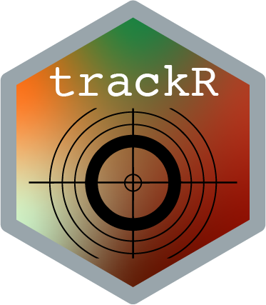

# trackR - Multi-object tracking with R 

## Description 

[`trackR`](https://github.com/swarm-lab/trackR) is an object tracker for R based 
on [OpenCV](https://opencv.org/). It provides an easy-to-use (or so we think) 
graphical interface allowing users to perform multi-object video tracking in a 
range of conditions while maintaining individual identities.

`trackR` uses RGB-channel-specific background subtraction to segment objects in 
a video. A background image can be provided by the user or can be computed by 
`trackR` automatically in most situations. Overlapping objects are then 
separated using cross-entropy clustering, an automated classification method that
provides good computing performance while being able to handle various types of 
object shapes (see [the CEC package for R](https://github.com/azureblue/cec) for 
more information on cross-entropy clustering). Most of the tracking parameters 
can be automatically estimated by `trackR` or can be set manually by the user. 

`trackR` also allows users to exclude parts of the image by using masks that can 
be easily created and customized directly within the app. 

Finally, `trackR` provides several convenience apps to correct common errors 
that occurs during video recording, to manually inspect and fix tracking errors, 
and to export publication-ready videos showing the moving objects with their 
track overlaid on top of them. 

---

## Quick start guides

+ [1 - Installation instructions](https://swarm-lab.github.io/trackR/articles/z1_install.html)
+ [2 - Preparing videos (optional)](https://swarm-lab.github.io/trackR/articles/z2_videoFixer.html)
+ [3 - Tracking videos](https://swarm-lab.github.io/trackR/articles/z3_trackR.html)

---

## FAQ

--

**How does `trackR` compare to other video tracking solutions? Did we really need another one?**

`trackR` belongs to the category of the 'classical' tracking programs. It relies 
on good ol' fashion image processing, robust cross-entropy clustering, and 
simple, yet efficient, assignment algorithms (the Hungarian method in this case). 
`trackR` does not include (for now) any fancy machine learning methods like those 
that can be found in the fantastic [`idtracker.ai`](http://idtracker.ai/) for 
instance. The downside is that `trackR`'s tracking reliability is inferior to 
the more advanced software (in particular when the objects cross paths); the 
upside is that it is fast and does not require a beast of a computer to run. 

`trackR` is more similar in spirit to tracking software such as [`Ctrax`](http://ctrax.sourceforge.net/), 
[`tracktor`](https://github.com/vivekhsridhar/tracktor), and the sadly defunct
[`SwisTrack`](https://en.wikibooks.org/wiki/SwisTrack). It will most likely 
provide tracking reliability equivalent to these excellent programs. However, 
we believe that `trackR`'s object segmentation and separation algorithms are 
generally more robust and should therefore be capable of handling a wider 
variety of situations. 

-- 

**Will something break? Can I use `trackR` in 'production' mode?** 

Something will definitely break. This is version 0.5 of the software, there is 
still a long way to go before it is a fully finished program. This being said, it 
will work fine in most cases and is certainly usable for most tracking projects.
If you run into an issue, please report it at: https://github.com/swarm-lab/trackR/issues.

--

**What features are in the works for future versions of `trackR`?**

At the moment, I am considering including the following features in future 
iterations of `trackR`:

1. ~~Add the possibility to save and restore settings for future use.~~ [DONE] 
2. ~~Add the possibility to indicate whether the objects to track are darker or 
  lighter than the background.~~ [DONE] 
3. Add live tracking using camera feed. [LONG TERM GOAL]
4. Add the possibility to feed the tracking data through a custom R script. 
  Currently, the data are saved in a CSV file and the user has to re-import them
  into R for post-processing. While this is fine for most use cases, it would not 
  work if the user needs some form of live processing of the tracking data. 
  [LONG TERM GOAL]
5. ~~Add some sort of GUI for manually correcting tracks.~~ [DONE]
6. Add AI-powered track correction. [IN PROGRESS]
7. Add app to automatically compute classic statistics on trajectories for users
  that do not want to/cannot run their own data analysis pipeline. [LONG TERM GOAL]

--

**How can I help?**

`trackR` is an open-source project, meaning that you can freely modify its code
and implement new functionalities. If you have coding skills, you are more than 
welcome to contribute new code or code improvement by submitting pull requests 
on the GitHub repository of the project at: https://github.com/swarm-lab/trackR. 
I will do my best to review and integrate them quickly. 

If you do not feel like contributing code, you can also help by submitting bug 
reports and feature requests using the issue tracker on the GitHub repository of 
the project at: https://github.com/swarm-lab/trackR/issues. These are extremely 
helpful to catch and correct errors in the code, and to guide the development of 
`trackR` by integrating functionalities requested by the community. 

---
