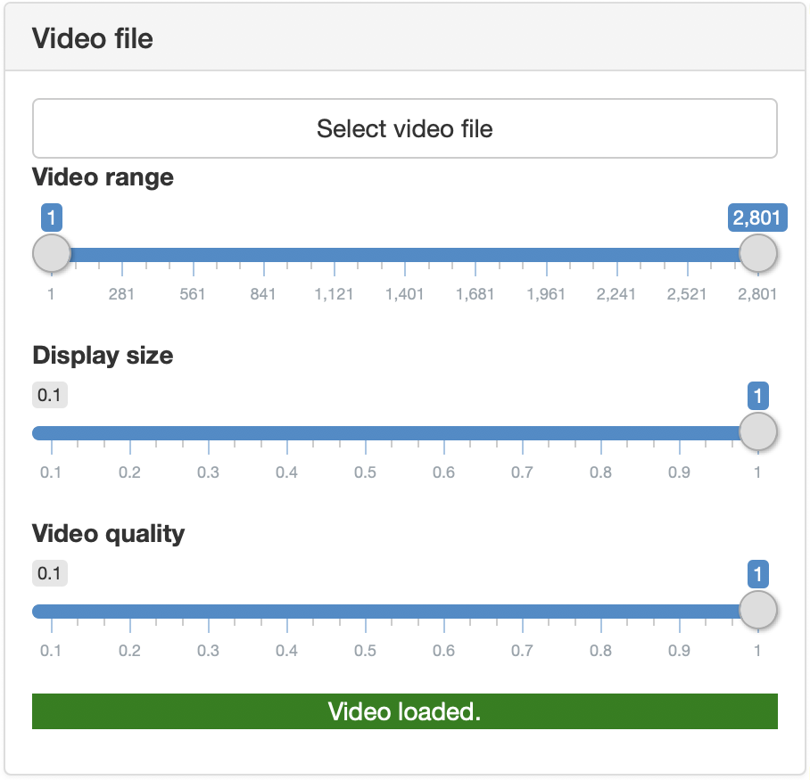

After launching `trackR`, the first step is to load a video file in memory. In 
the `Video file` tab (shown below), click on the `Select video file` button. This 
will bring up a file navigator. Use the file navigator to locate and select the 
video file that you would like to track. 

--- 

 {width=50%} 

---

Once the file is loaded in memory, new control sliders will automatically appear
in the `Video file` tab (see below). 

---

 {width=50%} 

---

+ `Video range` allows you to exclude parts of the video (at the beginning and 
end only) from the tracking process. This can be useful to ignore, for instance, 
the beginning of an experiment during which the animals are habituating to the 
environment. 
+ `Display size` allows you to change the size of the video display, for instance
if the video is too wide for the screen. It doesn't affect the video or tracking 
quality. 
+ `Video quality` allows you to reduce the resolution of the video. This can be 
useful to speed up the tracking process, at the expense of the tracking resolution. 
