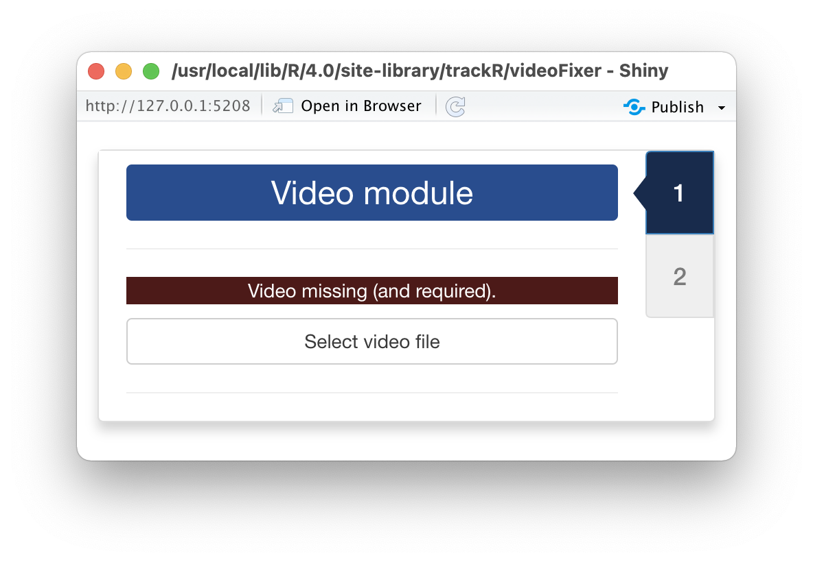
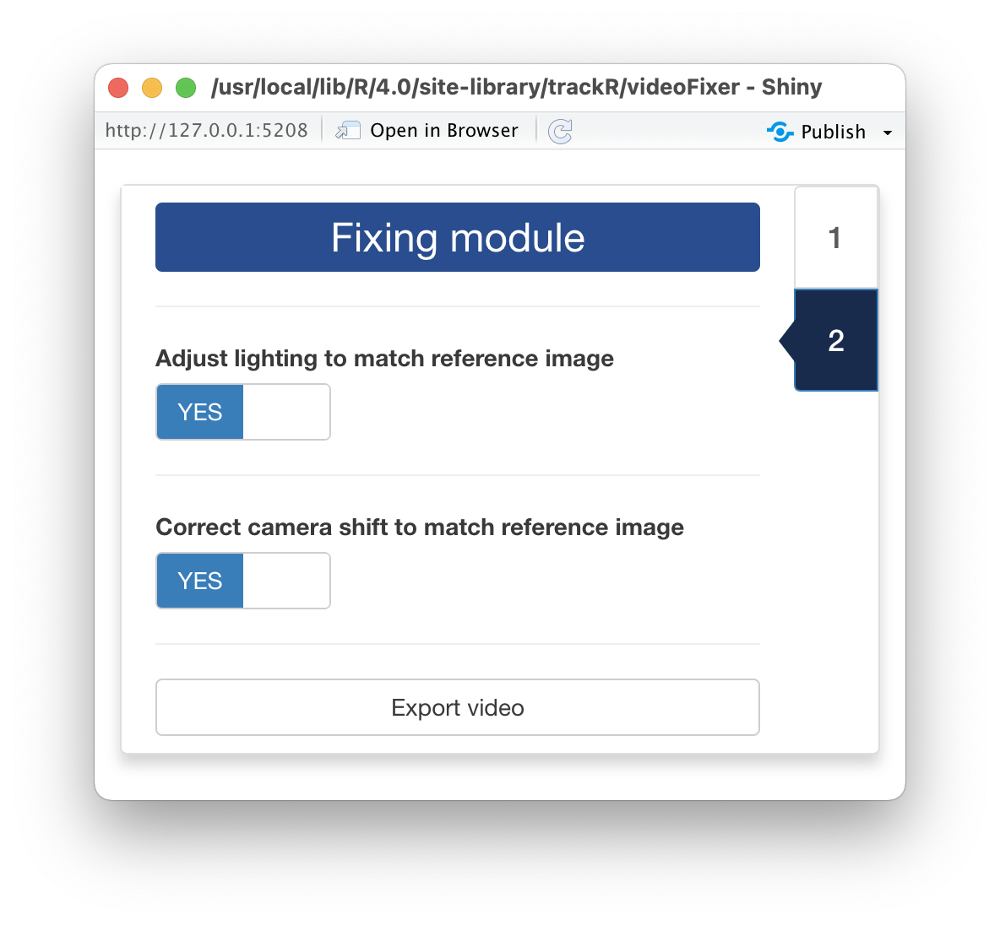

## 0 - Introduction

Videos can suffer from multiple issues that can make tracking difficult or even
prevent it altogether. Two of the most common issues are camera movement and 
light/color variations. Camera movement is often caused by improper camera 
support (e.g. ball head too weak for the weight of the camera) or by vibrations
or shocks received by the apparatus during the recording (e.g. if the apparatus
is accidentally knocked off position by the experimenter). Light and color 
variations are frequent when recording outdoors or when the apparatus is not 
properly isolated from external light sources (e.g. when someone opens up a door
or turn on and off the lights during an experiment). 

--- 

`trackR` provides a convenient utility to attempt to fix these common issues: 
`videoFixer()`. You can launch `videoFixer` by typing the following command in
your R console:

```r
videoFixer()
```

Note that using `videoFixer` is completely optional. If your videos have none of
the aforementioned issues, you can skip this step and move directly to the rest 
of the tutorials. 

--- 

## 1 - Video module

<div style="overflow: hidden;">



Once `videoFixer` has started, it will open two windows: a display window that 
will later be used to display the video (note: this window may be hiding behind 
other windows) and the window shown here that will display all the app controls.

First, you will need to click the "Select video file" button. This will bring up
a navigator that you will use to locate the video file that you would like to 
prepare for tracking. Once you have located the video file in the navigator, 
click the "Select" button. `videoFixer` will open the video and display its 
first image in the display window. 

</div>

---

<div style="overflow: hidden;">


After the video has been opened, the control panel will be updated to look like 
in the image shown here 

The 3 sliders in the control panel are the following:

+ `Display size` allows you to change the size of the display window, for 
instance if the video is too wide for the screen. It does not affect the video 
quality. 
+ `Select video range` allows you to exclude parts of the video (at the beginning 
and at the end) from the tracking process. This can be useful to ignore, for 
instance, the beginning of an experiment during which the animals are 
habituating to the environment. 
+ `Select a reference frame` allows you to select a frame from the video that 
will be used as a reference for adjusting the position and lighting of the 
other frames in the video. It is generally better to select a frame that shows 
as much as possible of the area to track and which lighting conditions are as 
representative as possible of the general lighting conditions in the rest of the
video. 

</div>

---

## 2 - Fixing module

<div style="overflow: hidden;">



After you have set the 3 aforementioned sliders to the desired values, click on 
the tab marked "2" on the right side of the control panel window. This will load 
the "Fixing module" that looks like the image shown here. 

In this module, you can decide what you would like `videoFixer` to fix. If your
video has lighting issues, turn the "Adjust lighting to match the reference
image" switch on. If your video has issues with camera movement, turn the 
"Correct camera shift to match the reference image" switch on. 

Once this is done, click the "Export video" button. This will open a navigator 
that will allow you indicate where to save the corrected video. After indicating 
the name of the new video file, click the "Save video as..." button and 
`videoFixer` will start processing the video and attempt to correct its lighting
and/or camera movement issue. 

</div>

---

Once `videoFixer` has finished processing the video and you have checked the 
result, you can proceed to the rest of the tutorials. 

+ [3 - Tracking videos](https://swarm-lab.github.io/trackR/articles/z3_trackR.html)
+ [4 - Inspect and fix tracking results](https://swarm-lab.github.io/trackR/articles/z4_trackFixer.html)
+ [5 - Export tracking results as video](https://swarm-lab.github.io/trackR/articles/z4_trackPlayer.html)
