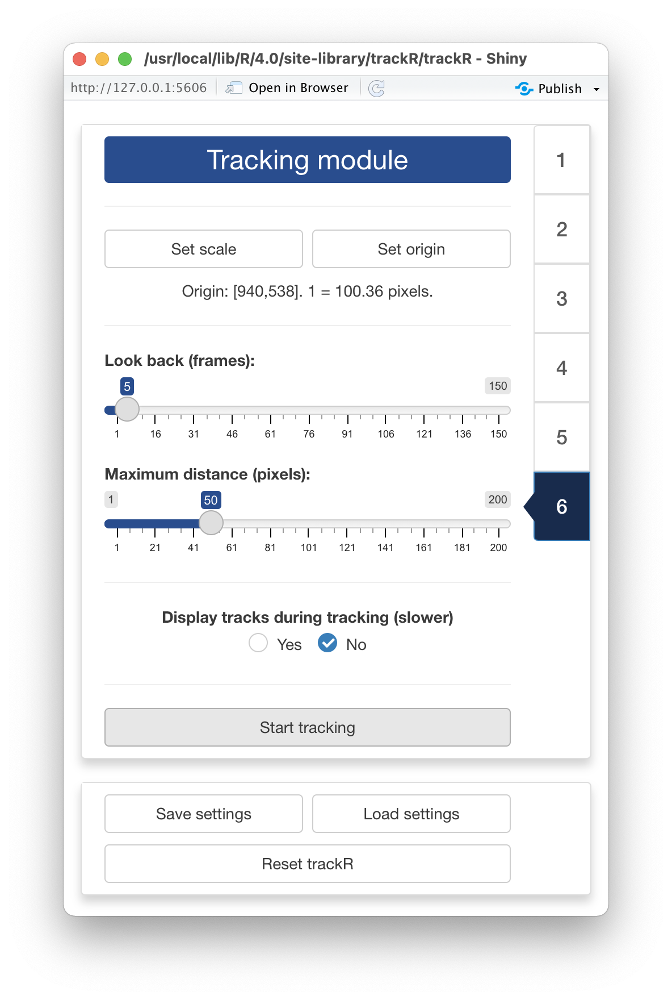

## 0 - Introduction

Once you are ready to track a video, you can launch `trackR` by typing the 
following command in the R console: 

```r
trackR()
```

---

## 1 - Video module

<div style="overflow: hidden;">


Once `trackR` has started, it will open two windows: a display window that will 
later be used to display the video (note: this window may be hiding behind other 
windows) and the window shown here that will display all the app controls.

At the bottom of the control window, you will find 3 buttons that will always be
present:

+ "Save settings" and "Load settings" will allow you to save and load settings 
  that you have set during the current tracking session or a previous one. 
+ "Reset trackR" will allow you to reset all of `trackR`'s settings to their 
  original values. 

The first thing that you will need to do is click the "Select video file" button. 
This will bring up a navigator that you will use to locate the video file that 
you would like to track. Once you have located the video file in the navigator, 
click the "Select" button. `trackR` will open the video and display its 
first image in the display window (see below). 

</div>

<center>  </center>

---

<div style="overflow: hidden;">


Once `trackR` has opened the video, new controls will appear in the control 
panel of the "Video Module" (see figure opposite). These new controls are: 

+ `Video range` allows you to exclude parts of the video (at the beginning 
  and at the end) from the tracking process. This can be useful to ignore, for 
  instance, the beginning of an experiment during which the animals are 
  habituating to the environment. 
+ `Display size` allows you to change the size of the display window, for 
  instance if the video is too wide for the screen. It does not affect the video 
  quality. 
+ `Video quality` allows you to reduce the quality of the video (i.e. decrease
  its resolution) in order to speed up the tracking process but with a possible
  reduction of the tracking precision, especially if the objects to track are 
  small. Note that the x/y coordinates that will be 
  returned by `trackR` will match the original resolution of the video. 
+ `Frame` allows you to navigate through the video. Frame 1 will correspond to 
  the lower bound of `Video range`, and the last frame will correspond to the upper 
  bound of `Video range`. 

Once you have set the parameters in the "Video module" to your liking, you can 
move to the "Background module" by clicking on the tab marked "2" on the right 
side of the control panel. 

</div>

---

## 2 - Background module

<div style="overflow: hidden;">


When in the "Background module", you can either choose to load an existing 
background image (e.g. an image of the empty experimental setup before the start
of the experiment) or you can ask `trackR` to automatically reconstruct that 
background from the video. 

If you choose to select an existing background image, just click on the "Select
existing background" button and use the navigator to locate and select the 
desired image. You can then skip the rest of this section and go directly to 
[the next section](#mask-module).

If you choose to let `trackR` reconstruct the background from the video, you 
will first need to decide on two things: 

+ The "Background type" which correspond to the algorithm that `trackR` will use
to reconstruct the background. Four algorithms are available:
  - "Mean" computes a background image in which each pixel is the average of the
  corresponding pixels in the selected video frames. This is a fast algorithm. 
  However it does not always produce good results.
  - "Median" computes a background image in which each pixel is the median of 
  the corresponding pixels in the selected video frames. This usually produces a 
  better result than "Mean", but will take significantly longer to complete. 
  - "Minimum" computes a background image in which each pixel is the minimum of 
  the corresponding pixels in the selected video frames. This usually produces a 
  good result when the objects to track are lighter than the background.
  - "Maximum" computes a background image in which each pixel is the maximum of 
  the corresponding pixels in the selected video frames. This usually produces a 
  good result when the objects to track are darker than the background.
+ The "Number of frames for estimating background". Better results are usually 
obtained with larger number of frames but the background will be slower to 
reconstruct. 

</div>

---

In some occasions, like in the image on the left below, `trackR` will not 
reconstruct the background completely. This can happen, for instance, when an 
object did not move at all during the entirety of the video like it is the case 
here. 

 

You can fix some of these "ghosts" by clicking the "Select ghost for removal" 
button. This will allow you to draw a polygon around the object to remove from 
the background by using the left button of your mouse/trackpad. Once you have 
surrounded the object with a polygon, use the right button of your mouse/trackpad
to close the polygon. `trackR` will then use the pixels surrounding the polygon
that you traced to replace the object with its best guess about the color of the
background below it. 

Once you are happy with background generated by `trackR`, you can click the 
"Save background file" button to save the background image for later (re)use. 

---

## 3 - Mask module {#mask-module}

<div style="overflow: hidden;">


The "Mask module" is optional. It should be used if you would like to restrict 
tracking to specific areas of the image, for instance to exclude the outside of 
an experimental arena where things may be moving that should not be tracked 
(e.g. the hands of the experimenter). By default, `trackR` will use the entirety
of the visible frame to perform the tracking. 

The control panel of the "Mask module) allows you to either use an existing mask
or to design your own. To use an existing mask, click the "Select existing mask"
button and use the navigator to locate and select the desired mask image. A mask
image should be a black and white image of the same resolution of the video. 
White portions of the image will be included in the traffic while black portion
will be excluded. 

If you would like to design your own mask (or modify an existing mask that you 
have loaded in `trackR`), you can use the following controls:

+ "Include all" tells `trackR` to use the entirety of the visible frame to 
perform the tracking. This is a useful button to reset the mask to its default
setting.
+ "Exclude all" tells `trackR` to use none of the visible frame to perform the 
tracking. This is a useful button to wipe out the mask before adding authorized 
areas for tracking using the "Add polygon ROI" and "Add ellipse ROI" buttons.
+ "Add polygon ROI" allows you to draw a polygon on the mask by using the left 
button of your mouse/trackpad. Once you are sastified with your polygon, use the 
right button of your mouse/trackpad to close it. If the "Including" radio button
is selected, then the area inside the polygon will be included in the tracking. 
Otherwise, it will be excluded. 
+ "Add ellipse ROI" allows you to draw an ellipse on the mask by indicating 5 
points along the periphery of the area of interest. Use the left button of your 
mouse/trackpad for this. Once you have finished adding the 5 points, `trackR` 
will compute the ellipse best fitting them. It is recommended to select 5 points 
that are roughly equidistant along the periphery of the area of interest. If the 
"Including" radio button is selected, then the area inside the ellipse will be 
included in the tracking. Otherwise, it will be excluded. 

You can combine including/excluding polygons and ellipses to define a mask as 
complex and detailed as you would like. Included areas will take a slightly 
greener tint in the display window while excluded areas will take a slightly 
more red tint (see images below). 

Once you are satisfied with your design, you can save it for later (re)use by 
clicking the "Save mask file" button. 

</div>

 

---

## 4 - Segmentation module

<div style="overflow: hidden;">


Segmentation is the process of isolating objects of interests from the background
of an image. In order to do so, `trackR` first needs to know whether it is 
looking for objects that are darker or lighter than the background. You can do 
so by ticking the appropriate radio button at the top of the control panel in 
the "Segmentation module". 

Once this is done, `trackR` will need to know how different from the background
a pixel must be to be considered a part of one of the objects to track. In order
to indicate that information to `trackR`, you can use the 3 RGB threshold sliders
in the control panel. They will allow you to set the threshold differences in 
each of the 3 color channels of the image (Red, Green, Blue) above which a pixel
is considered a part of an object and not a part of the background. 

The objective is to find a set of thresholds that create a good separation 
between the objects to track and the background. You can see the result of 
changing the thresholds in the display window: all the parts of the image that 
are considered an object given the thresholds will be surrounded by a green line
(see images below). A good set of thresholds will results in green lines tightly
following the edges of the objects to track, like in the second image below. If 
the green lines surround parts of the background (like in the first image below)
then the selected thresholds are not stringent enough and can be increased for 
better results. On the contrary, if the green lines are missing some or all 
parts of the objects to track, then the selected thresholds are too stringent 
and can be decreased for better results. 

You can also let `trackR` search for good thresholds by clicking the 
"Automatically optimize thresholds" button in the control panel. `trackR` will 
use a genetic algorithm to look for thresholds that provide good segmentation 
results in general. You can then tweak manually these suggested thresholds if 
you want. 

Finally, you can use the "Frame" slider at the bottom of the control panel to 
look at the result of the segmentation process in different parts of the video. 
This is recommended to make sure that the selected thresholds give good results 
throughout the video. 

</div>

 

---

## 5 - Separation module

<div style="overflow: hidden;">


By default, `trackR` can track objects reliably as long as they do not come in
close contact with each other. When that happens, however, `trackR` will use a 
number of heuristics to try and separate them. These heuristics are based on 
various parameters of the objects, namely: 

+ Their maximum length, in pixels
+ Their maximum width, in pixels
+ Their maximum surface area, in pixels
+ Their density, that is the ratio between their surface area and the surface
area of the ellipse that is enclosing the object (objects with a high density 
resemble better perfect ellipsoids). 

You can set these parameters manually using the corresponding input boxes in the 
control panel of the "Separation module". You can also let `trackR` search for 
good values for these parameters by clicking the "Automatically optimize object 
parameters" button in the control panel. `trackR` will look for parameters that 
provide good separation results in general. You can then tweak manually these 
suggested parameters if you want. 

Finally, you can use the "Frame" slider at the bottom of the control panel to 
look at the result of the separation process in different parts of the video. 
This is recommended to make sure that the selected parameters give good results 
throughout the video. 

</div>

<center>  </center>

---

## 6 - Tracking module

<div style="overflow: hidden;">



You made it to the tracking module! You are just a few clicks away from starting 
to track your video. 

The first thing that you can do in this module is set the scaling factor between
the coordinates of the objects in the video (in pixels) and their coordinates in
the "real world". This step is optional but can be very useful if you are 
interested in, later, computing trajectory statistics in real-world units or in 
comparing trajectory statistics between different replicates of your experiment. 

In order to do this, click the "Set scale" button in the control panel of the 
"Tracking module". `trackR` will ask you to select 2 reference points in the 
image shown in the display panel (see image on the left below). Once this is 
done, `trackR` will ask you to specify the distance between these 2 reference 
points in real-world units. 

You can also specify a different origin for the real-world coordinates. By 
default, the origin is set at the bottom-left corner of the image. If you would 
like to change that, click the "Set origin" button. `trackR` will ask you to
select a point in the image shown in the display panel. Once this is done, this
point will become the new origin (i.e. the new [0,0]) of the real-word 
coordinates. 

Finally, there are a few more controls that you can set before launching the 
tracking: 

+ `Speed-up` controls the number of segmented pixels that are passed to the 
  separation algorithm. The higher this number is, the less segmented pixels are
  sent to the separation algorithm, effectively speeding it up. However, this 
  may impact the quality of the tracking, especially if the objects to track are 
  small.
+ `Look back` controls how many past frames the tracking algorithm should take 
  into account to associate each detected object to a track. This is a useful 
  parameter to take into account if, for instance, the objects tend to disappear 
  for a few frames from time to time. 
+ `Maximum distance (pixels)` controls the maximum distance in pixels that an 
  object can move between two frames to be still considered as belonging to the 
  same track. 
+ `Display tracks during tracking (slower)` controls whether the video with the 
  overlaid tracking results is played as the tracking is happening. If it is, 
  this will slow down the tracking process, but this can be used to check that 
  the tracking is working well when looking for the right set of parameters. 

Once all is set, you can finally click on the `Start tracking` button, set a
file in the navigator that pops up to store the tracking data, and just let 
`trackR` works its magic. The data will be saved as a CSV file and 
[the next section](#output) will detail the content of this file. 

</div>

 

---

## 7 - Output data {#output}

Once `trackR` is done tracking the video, the resulting CSV file will contain
between 8 and 12 columns depending on whether you have set a real-world scale 
and origin in the "Tracking module". These columns will be the following:

+ `frame` is the video frame number at which the measurements along the 
  corresponding row have been made. 
+ `track` is the identity of the tracked object as estimated by `trackR`.
+ `x` is the x coordinate of the object location in pixels in the context of the 
  video frame. The origin is set at the bottom-left corner of the frame. 
+ `y` is the y coordinate of the object location in pixels in the context of the 
  video frame. The origin is set at the bottom-left corner of the frame. 
+ `width`	is the width in pixels of the object. 
+ `height` is the height in pixels of the object.
+ `angle`	is the angle in degrees between the main axis of the object and the y
  axis. 
+ `n`	is the number of pixels covered by the object in the image. If you set the
  `Video quality` slider in the "Video module" to a value lower than 1, then 
  this number if an approximation. 

Plus, if you have set a real-world scale and origin in the "Tracking module":
+ `x_[unit]` is the x coordinate of the object location in real-world [unit] 
  The origin is set to the real-worl equivalent to that you have defined in the 
  "Tracking module". 
+ `y_[unit]` is the y coordinate of the object location in real-world [unit] 
  The origin is set to the real-worl equivalent to that you have defined in the 
  "Tracking module". 
+ `width_[unit]` is the width in real-world [unit] of the object. 
+ `height_[unit]` is the height in real-world [unit] of the object.  

You can now proceed to the rest of the tutorials. 

+ [4 - Inspect and fix tracking results](https://swarm-lab.github.io/trackR/articles/z4_trackFixer.html)
+ [5 - Export tracking results as video](https://swarm-lab.github.io/trackR/articles/z4_trackPlayer.html)


---

The video used throughout this tutorial was provided by *Sridhar, V. H., Roche, 
D. G., and Gingins, S. (2019). Tracktor: Image-based automated tracking of animal 
movement and behaviour. Methods Ecol. Evol. 10, 691. doi:10.1111/2041-210X.13166*
and used here with permission of the authors. 
