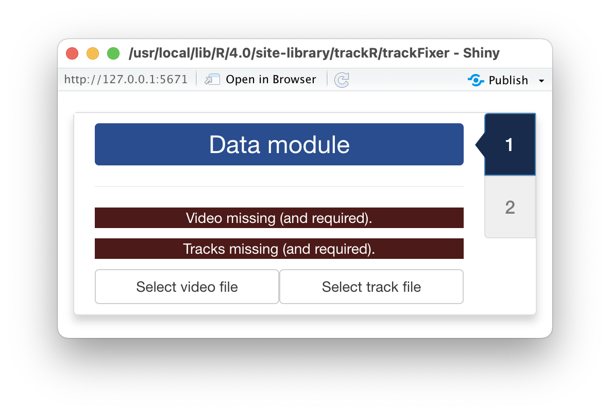
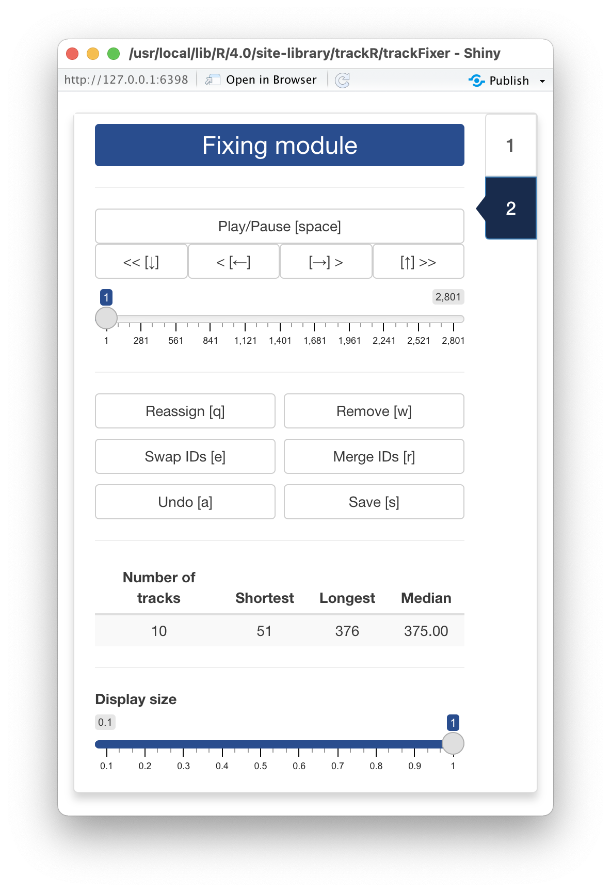
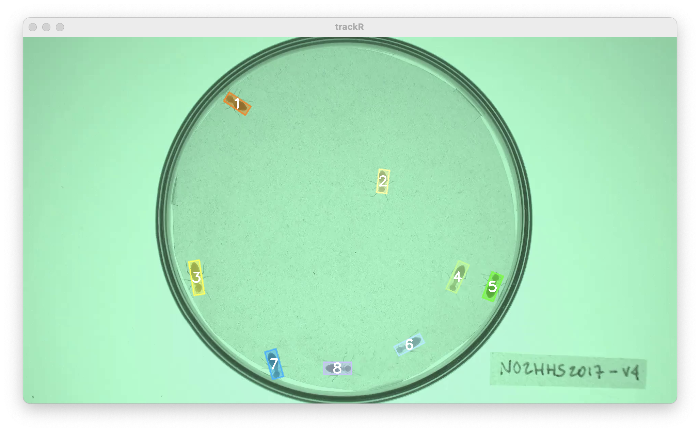

## 0 - Introduction

Once you have finished tracking a video, you can manually inspect the results 
and fix any potential error using the `trackFixer` app provided with the 
package. You can launch `trackFixer` by typing the following command in the R 
console: 

```r
trackFixer()
```

---

## 1 - Data module

<div style="overflow: hidden;">



Once `trackFixer`  has started, it will open two windows: a display window that 
will later be used to display the video with the tracks overlaid on top (note: 
this window may be hiding behind other windows) and the window shown here that 
will display all the app controls.

The first step is to open the video and track files using the dedicated buttons
in the control panel. Each button will open a navigator that you can use to find
and select the video that was used during tracking and the CSV file that was 
produced by `trackR` after tracking was completed. 

Note that the CSV file is never modified by `trackFixer`. Instead, `trackFixer` 
will save the tracking corrections to a separate file in order to never destroy
the original tracking results.

</div>

---

## 2 - Fixing module

<div style="overflow: hidden;">



As soon as the video and track files are opened, `trackfixer` will automatically
switch to its "Fixing module" displayed in the image opposite and will show the
video in the display window with the tracks overlaid (see image below). 

At the bottom of the control panel, there is a `Display size` control slider 
that allows you to change the size of the display window, for instance if the 
video is too wide for the screen. 

At the top of the control panel, you will find the video controls that allow you
to: 

+ Play and pause the video with the `Play/pause` button or with the space bar of
  your keyboard. 
+ Advance or rewind the video by 1 frame with the `>` and `<` buttons or with 
  the right and left arrow keys of your keyboard. 
+ Advance or rewind the video by 1 second with the `>>` and `<<` buttons or with 
  the up and down arrow keys of your keyboard. 
+ Move to any frame of the video with the slider below the video control buttons.

Below are 6 buttons that allow you to perform a number of correcting operations 
if you find that `trackR` made a mistake during tracking: 

+ The `Reassign` button (or the "q" key of your keyboard) will open the 
  reassignment menu. When the menu has opened, you can use the first dropdown 
  selector to select which track to assign a new number to or to reassign to a 
  previously existing track. You can then type in the input box below the number
  you would like to assign to the track. 
+ The `Remove` button (or the "w" key of your keyboard) will open the removal 
  menu. When the menu has opened, you can use the dropdown selector to select 
  which track to remove. 
+ The `Swap IDs` button (or the "e" key of your keyboard) will open the ID 
  swapping menu. When the menu has opened, you can use the 2 dropdown selectors 
  to select which tracks to swap. Note that swapping will occur from that frame 
  on. Previous frames will not be affected and tracks will retain their original 
  ID.
+ The `Merge IDs` button (or the "r" key of your keyboard) will open the ID 
  merging menu. When the menu has opened, you can use the 2 dropdown selectors 
  to select which tracks to merge together. Note that the resulting track will
  retain the ID of the first selected track.
+ The `Undo` button (or the "a" key of your keyboard) will undo any change made
  during the fixing session in the reverse order that they have been made. 
+ The `Save` button (or the "s" key of your keyboard) will save the modifications
  that you have made during the fixing session. These modifications are saved in
  a different file than the one containing the original tracking results to 
  prevent accidental modifications to permanently damage the original results. 
  The modified file will have the same name and be saved at the same location as 
  the original file but with "_fixed" appended to its name. Note that if you 
  interrupt your fixing session before the end of the video, you can resume it 
  by loading the "[original_file_name]_fixed.csv" file instead of the original 
  one. In this case, any new correction will also be saved to the 
  "[original_file_name]_fixed.csv" file. 

Finally, some basic statistics about the tracks are displayed below the fixing 
controls. These can be useful to track your progress during a fixing session.
For instance, if the statistics table shows that your file contains 10 tracks 
but you know you only had 8 individuals in your experiment, this is a good 
indication that some errors remain to be fixed. 

</div>

<center>  </center>

---

## 3 - Output data

Once you click the `Save` button in `trackFixer`, the data that is saved in the
"[original_file_name]_fixed.csv" file has the same columns has those saved 
originally by `trackR` (see [here for more details](z3_trackR.html#output)). 

The file will also contain 2 additional columns:

+ `track_fixed` is the identity of the tracked object after the corrections have
  been applied. The `track` column retains the original, uncorrected identity.
+ `ignore` indicates whether you can ignore (TRUE) or not (FALSE) the 
  corresponding row when you analyze the data. Ignored rows are those, for 
  instance, from tracks that you have chosen to remove or merge with another 
  track. 
  
You can now proceed to the rest of the tutorials. 

+ [5 - Export tracking results as video](https://swarm-lab.github.io/trackR/articles/z5_trackPlayer.html)

---

The video used throughout this tutorial was provided by *Sridhar, V. H., Roche, 
D. G., and Gingins, S. (2019). Tracktor: Image-based automated tracking of animal 
movement and behaviour. Methods Ecol. Evol. 10, 691. doi:10.1111/2041-210X.13166*
and used here with permission of the authors. 
