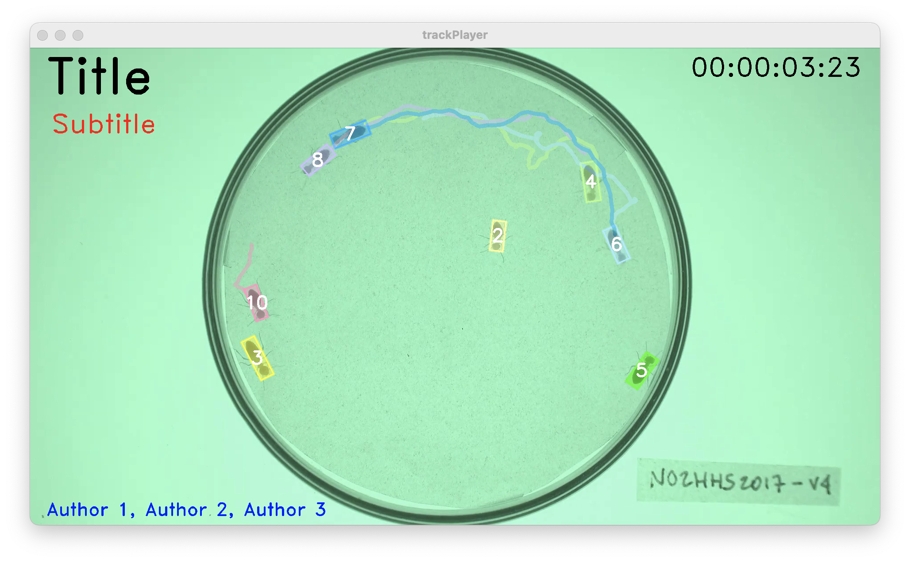

## 0 - Introduction

Once you have finished tracking a video and fixing any potential error, you can
use the `trackPlayer` app to create a nice, publication-ready video showing the 
results of the tracking overlaid over the frames. You can launch `trackPlayer` 
by typing the following command in the R console: 

```r
trackPlayer()
```

---

## 1 - Data module

<div style="overflow: hidden;">


Once `trackPlayer`  has started, it will open two windows: a display window that 
will later be used to display the video with the tracks overlaid on top (note: 
this window may be hiding behind other windows) and the window shown here that 
will display all the app controls.

The first step is to open the video and track files using the dedicated buttons
in the control panel. Each button will open a navigator that you can use to find
and select the video that was used during tracking and the CSV file that was 
produced either by `trackR` after tracking was completed or by `trackFixer` 
after fixing any potential tracking error. 

</div>

---

## 2 - Play module

<div style="overflow: hidden;">


As soon as the video and track files are opened, `trackPlayer` will automatically
switch to its "Play module" displayed in the image opposite and will show the
video in the display window with the tracks overlaid (see image below). 

At the top of the control panel, you will find the video controls that allow you
to: 

+ Select with the `Video range` slider the portion of the video that you would 
  like to export.
+ Play and pause the video with the `Play/pause` button or with the space bar of
  your keyboard. 
+ Advance or rewind the video by 1 frame with the `>` and `<` buttons or with 
  the right and left arrow keys of your keyboard. 
+ Advance or rewind the video by 1 second with the `>>` and `<<` buttons or with 
  the up and down arrow keys of your keyboard. 
+ Move to any frame of the video with the slider below the video control buttons.

Below is a `Display size` control slider that allows you to change the size of 
the display window, for instance if the video is too wide for the screen. This 
does not affect the quality of the exported video. 

Below are four buttons that will allow you to add text and timestamps to the 
exported video. Clicking on any of these 4 buttons will open a menu with all the 
necessary controls to set the content, position, size and color of these 
pieces of text (see image on the left below). Note that title, subtitle, and 
author list are just suggestions. You can actually use any of these 3 options to
add any text you would like. Timestamp, however, will just do that: add an
hour:minute:second:frame timestamp at the desired location on the video.

Finally, at the bottom of the control panel is an `Export video` button that you
can press in order to export an MP4 video showing the results of the tracking 
overlaid on top of the frame. This video should play well in all presentation 
programs (e.g. PowerPoint, Apple Keynote), on any website, and as supplementary
material for your publications. 

</div>

  

---

The video used throughout this tutorial was provided by *Sridhar, V. H., Roche, 
D. G., and Gingins, S. (2019). Tracktor: Image-based automated tracking of animal 
movement and behaviour. Methods Ecol. Evol. 10, 691. doi:10.1111/2041-210X.13166*
and used here with permission of the authors. 
