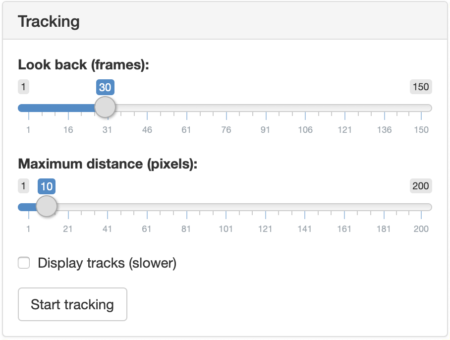

<mark>**This page applies to `trackR("classic")`, `trackR("quanta")`, and 
`trackR("tracktor")`.**</mark>

---

If you made it all the way here, you are almost ready to start the tracking 
itself. The `Tracking` tab (shown below) contains a couple of control sliders to
consider before you can finally get the data you have been patiently waiting for. 

---

 {width=50%} 

---

+ `Look back` controls how many past frames the tracking algorithm should take 
  into account to associate each blob to a track. This is a useful parameter to 
  take into account if, for instance, the objects tend to disappear for a few 
  frames from time to time. 
+ `Maximum distance (pixels)` controls the maximum distance in pixels that a blob 
  can move between two frames to be still considered as belonging to the same 
  track. 
+ `Display tracks (slower)` controls whether the video with the overlaid tracks 
  is played as the tracking is happening. If it is, this will slow down the 
  tracking process, but this can be used to check that the tracking is working 
  well when looking for the right set of parameters. 
  
Once all is set, you can finally click on the `Start tracking` button and let 
`trackR` works its magic. The data will be saved as a CSV file in the same folder
as the video file. 
